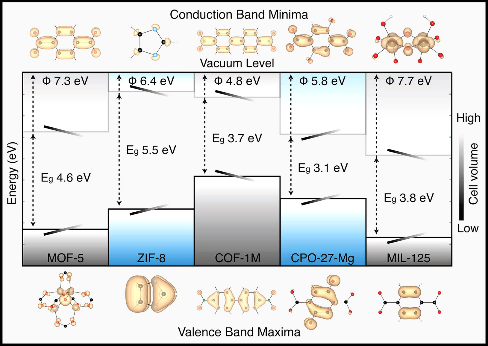

# Wednesday September 6th, Bath.
## About

We are delighted to announce the 1st Band Alignment Bootcamp, to be held in the beautiful, historical city of Bath on September 6th. The one day workshop will provide an overview of  the theory and practice of band alignment for semiconductor applications. We will also run a hands on tutorial, using the [MacroDensity](http://wmd-group.github.io/MacroDensity/) code to construct band alignment diagrams for bulk semiconductors, nanoporous frameworks and epitaxial heterostructures.

## Who is it for?

Anyone interested in constructing energy-band-alignment diagrams using plane wave density functional theory approaches. From the everyday practitioner (industrial or academic) to the gifted amateur and everyone in between.

## What does it cost?

Nothing. And lunch is included!

## What will it cover?

* An introduction to energy band alignment diagrams in semiconductor applications.

* A background to experimental determination and modern characterisation techniques for band alignment. [**Dr. Tim Veal, University of Liverpool**](http://pcwww.liv.ac.uk/~timveal/)

* A theoretical background to band alignment using plane wave density functional theory. [**Dr. Keith Butler, University of Bath**](http://people.bath.ac.uk/ktb22/)

* Hands on practicals using [MacroDensity](http://wmd-group.github.io/MacroDensity/) to construct energy-band-alignment diagrams for
	* Bulk semicondutor materials
	* Nanoporous frameworks
	* Epitaxial heterostructures

## How can I sign up?

Please go to our [Eventbrite page](https://www.eventbrite.com/e/bandalignmentbootcamp-tickets-32649482481?utm_source=eb_email&utm_medium=email&utm_campaign=order_confirmation_email&utm_term=eventname&ref=eemailordconf) to sign up.

## Where and when is it exactly?

The workshop will be held from 11:00 am – 16:00 pm in the [Bath Royal Literary and Scientific Institution](https://www.brlsi.org/), in the heart of Bath.

<iframe src="https://www.google.com/maps/embed?pb=!1m14!1m8!1m3!1d4980.376439183488!2d-2.3662624060598354!3d51.38121867453923!3m2!1i1024!2i768!4f13.1!3m3!1m2!1s0x0%3A0x5da38db64012c6af!2sBath+Royal+Literary+%26+Scientific+Institution!5e0!3m2!1sen!2suk!4v1492099417502" width="600" height="450" frameborder="0" style="border:0" allowfullscreen></iframe>

## What should I bring?

A laptop computer with [MacroDensity](http://wmd-group.github.io/MacroDensity/) installed.

